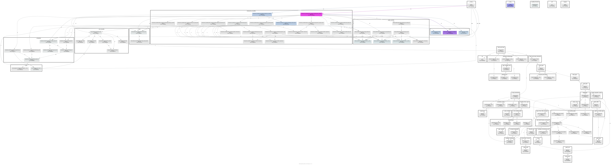

# 开发规范
## 命名规范：
### 1. 变量名、函数名和方法名：小写字母和下划线（snake_case）
### 2. 类名：大驼峰（PascalCase）

# 文件结构说明（tree指令）
```shell
├── redis_handler 
│   ├── redis_handle.py # RedisClient类
│   └── redis_task_utils.py # redis消息队列相关工具函数集合
├── rule_handler
│   ├── __init__.py
│   ├── rules.py # 规则检测集合
│   └── schema.py # 调度信息参数列表
├── scheduler
│   ├── __init__.py
│   └── schedule_handle.py # 处理调度信息工具函数集合
├── server_logs # wechat_server日志信息
│   ├── server.log
├── utils
│   ├── __init__.py
│   ├── config.py # Config类
│   ├── exception_handle.py # 自定义异常类
│   ├── log_handle.py # server_log函数
├── chat
│   ├── chat_tool.py 
│   ├── ierror.py
│   ├── message_hander.py
│   ├── wechat_client.py
│   └── WXBizMsgCrypt3.py
├── docs
│   ├── dev.md # 开发者文档
│   ├── display.md # 功能展示
│   └── images # 原始图片
├── interaction_handler
│   ├── __init__.py 
│   ├── admin_interact_handle.py # 管理员和小智交互逻辑集合
│   ├── cus_interact_handle.py # 用户和小智交互逻辑集合
├── LLM
│   ├── __init__.py
│   ├── assistant.py # 大模型流程的api调用
├── logs
│   ├── weichat.log # web_api.py的日志信息
├── msg_handler.py # 流程总控程序
├── config.ini # 配置文件
├── web_api.py # 服务器程序
├── requirements.txt # 依赖说明文档
├── README.md # 项目介绍文档
```

# 函数调用图
## 调用pycallgraph绘制动态函数调用关系图如下：


# 系统架构图
利用drawio绘制
将之前的思路抽象成相应的模块再进行绘制
参考 https://blog.csdn.net/kion0929/article/details/102667123

# 部署
环境准备，依赖安装说明，怎么运行等等
大致的流程（主要分为两个模块即用户和管理员的相关交互）
每个模块用
