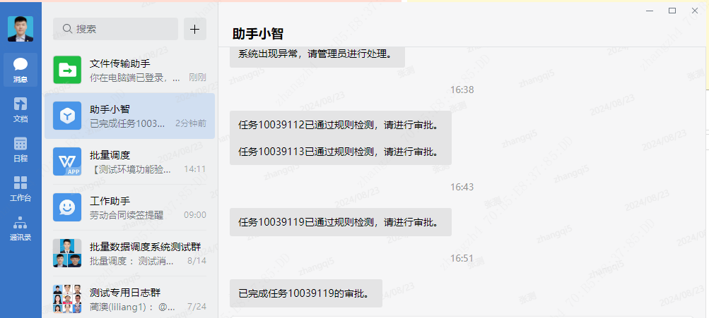

# 一、演示对象说明
## 管理员：zhangzh4和zhangqi5   用户：zhangxs1和gongwj

# 二、用户和小智交互
## 1. 用户请求审批任务ID
### a. 任务ID规则检测
#### 若规则检测不通过，则用户收到具体任务ID的具体的问题
#### 若规则检测通过，则通知用户和管理员任务通过规则检测
#### 若查询不到任务ID，则用户收到提示信息

#### 若任务检测通过，所有管理员(zhangzh4和zhangqi5)都能接收到任务检测通过的消息：

### b. 重复请求任务ID
#### 若重复请求任务ID，会通知当前申请者，同时不会通知任何管理员

### c. 无法抽取任务ID
#### 审批相关的信息但是没有输入任务ID

## 2. 输入和审批任务无关的信息
#### 大模型自动回复

## 3. 系统出现异常情况
#### 系统出现异常后，通知用户系统出现异常，无法正常使用

#### 通知所有管理员，系统出现异常，请及时处理

# 二、管理员和小智交互
## 1. 管理员查看待审批用户列表
#### 若存在待审批用户列表，则返回审批队列中所有申请者名字

#### 若不存在待审批用户列表，则返回相应的提示信息

## 2. 管理员检查任务ID
#### 若检查的任务ID存在问题，则返回具体问题信息列表
#### 若检查的任务ID没有问题，则返回通过规则检测信息，同时将该任务加入待审批队列，进行管理员查看和审批任务等功能

#### 若检查的任务ID不存在，则返回提示信息

## 3. 管理员查看任务
### a. 查看所有任务
#### 没有指定任务ID和用户名称时，返回待审批队列默认前三个任务的相关信息

#### 系统出现异常查询不到相关任务信息时，返回提示信息

### b. 查看名下任务
#### 查看的是调度平台待审批列表的任务ID
#### 若查看的名称存在，返回名称下的所有任务ID列表

#### 若查看的名称不存在，返回提示信息

### c. 查看具体任务ID
#### 若任务ID存在，则返回具体任务ID的相关信息

#### 若任务ID不存在，则返回查看失败的提示信息

## 4. 管理员审批任务
### a. 通过/不通过待审批任务ID
#### 如果通过/不通过待审批任务成功，则通知所有管理员任务ID审批通过/不通过

#### 如果通过/不通过任务ID失败，则查找不到相关任务或者调度平台本身出问题等

### b. 通过/不通过名下任务
#### 通过/不通过任务ID和通过/不通过名下任务一致

#### 若通过/不通过任务成功后，正在操作的管理员收到任务审批结果的信息

#### 申请该任务的用户收到任务审批结果的提示信息

#### 其他管理员收到任务审批结果的信息

